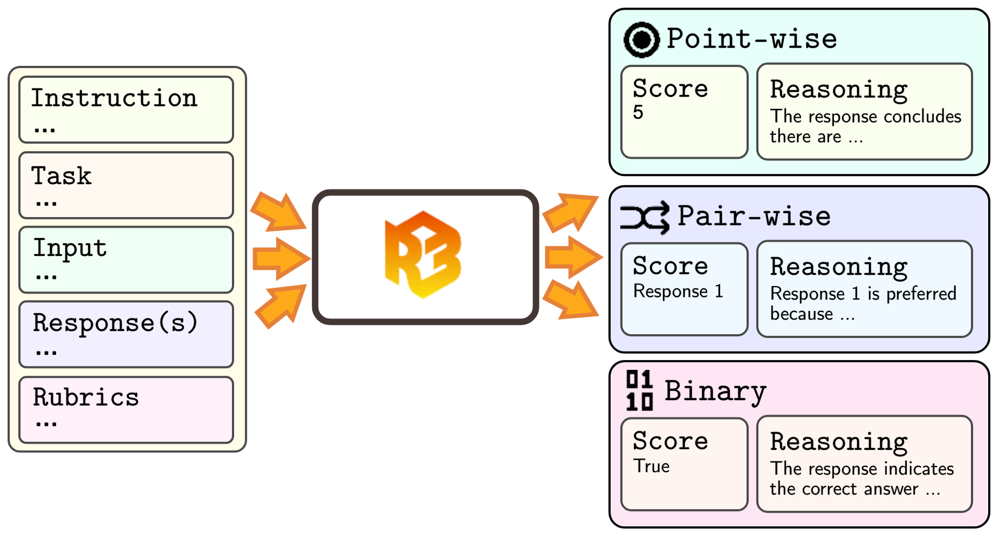
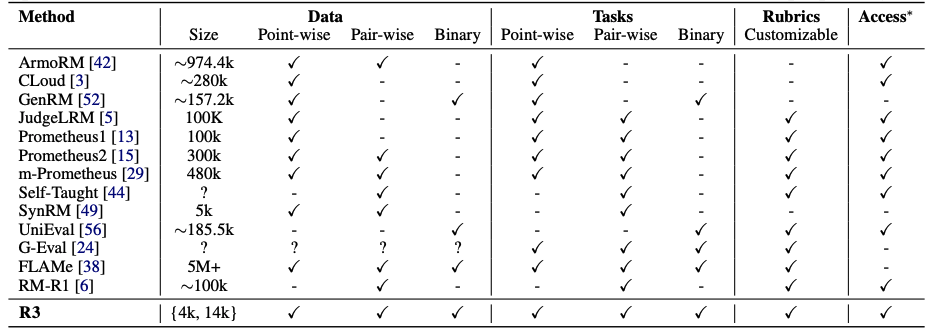

#  R3: Robust Rubric-Agnostic Reward Models

<p align="left">
  <a href="https://huggingface.co/collections/rubricreward/r3-models-681eaf578072a433274f5a99">
    
  </a>
  <a href="https://huggingface.co/collections/rubricreward/r3-datasets-682819071912cad389d265d8">
    
  </a>
  <a href="https://arxiv.org/abs/2505.13388">
    
  </a>
  <a href="https://rubricreward.github.io">
    
  </a>
  <a href="https://github.com/rubricreward/r3/blob/main/LICENSE">
    
  </a>
</p>

<p align="center">
  
</p>

**TL;DR**: **R3** is a novel rubric-agnostic reward modeling framework that delivers **interpretable**, **controllable**, and **generalizable** score assignments. Built on **reasoning distillation**, **targeted data curation**, and a **two-stage filtering pipeline**, **R3** achieves state-of-the-art results—even when trained on datasets *10× smaller* than many baselines.

## 📦 Contents

+ [🤔 Why R3?](#-why-r3)
+ [⚙️ Setup Instructions](#%EF%B8%8F-setup-instruction)
+ [🚀 Using Our Model (Inference & Deployment)](#-using-our-model-inference--deployment)
+ [🧩 Using Our Codebase](#-using-our-codebase)
+ [📚 Citation](#-citation)

## 🤔 Why R3?

<p align="center">
  
</p>

**The table above** compares R3 to existing reward models across key dimensions:

- **🧠 Task Diversity**: R3 supports *point-wise*, *pairwise*, and *binary classification* tasks—covering instruction following, reasoning, and factuality.
- **📊 Supervision Format**: It handles all major data formats: point-wise scores, preference comparisons, and classification-based labels.
- **🧩 Rubric Agnosticism**: Unlike many models, R3 does **not rely on fixed evaluation rubrics**. Instead, it generalizes across rubrics—making it easily customizable for new use cases.
- **📦 Compactness**: R3 achieves broad task coverage using **just 4k–14k training examples**, whereas many baselines use **100k–5M+**.
- **🔓 Accessibility**: R3 is open and accessible, making it suitable for lightweight deployment, reproducibility, and extensibility.

In short, R3 offers **full-spectrum functionality**—matching or exceeding other models on task generality and rubric flexibility, all while using **an order of magnitude less data**.

<p align="center">
  
</p>

R3 is trained on a diverse, carefully curated mix of point-wise, pair-wise, and binary tasks dataset as shown in the above diagram:

- **🗣️ General Chat & Instruction-Following**: Includes open-domain instruction and user preference datasets such as *Tulu*, *UltraFeedback*, and *Skywork Reward Preference*. These cover both point-wise and pairwise supervision signals.
- **🧠 Reasoning Tasks**: Focuses on math and code evaluations using datasets like *Math-Step-DPO-10K* and *AceCodePair-300K*, with annotations targeting correctness and reasoning quality.
- **✅ Classification & Factuality**: Encompasses factual consistency, summarization quality, and NLI tasks. Key datasets: *GLUE*, *SuperGLUE*, *SummEval*, *FeedbackCollection*, *PreferenceCollection*, and *EVOUNA*. These span both rubric-driven binary classification and pairwise preference setups.

This diverse dataset mix powers R3's generalization and robustness across evaluation dimensions and task formats.

## ⚙️ Setup Instruction

Python 3.10 or higher are recommended. To install required dependencies, simply run `pip install -e .` as it will automatically setup everything. Details of dependencies are in `setup.py`.

## 🚀 Using Our Model (Inference & Deployment)

You can use our R3 models directly from our [🤗 R3 Models Collection](https://huggingface.co/collections/rubricreward/r3-models-681eaf578072a433274f5a99).

### 🧠 Using `transformers`

Below is an example of using our `R3-Qwen3-14B-LoRA-4k` model using 🤗 `transformers`:

```python
from transformers import AutoModelForCausalLM, AutoTokenizer

model_name = "rubricreward/R3-Qwen3-14B-LoRA-4k"

# load the tokenizer and the model
tokenizer = AutoTokenizer.from_pretrained(model_name)
model = AutoModelForCausalLM.from_pretrained(
    model_name,
    torch_dtype="auto",
    device_map="auto"
)

# prepare the model input
messages = [
    {'content': "Evaluate the response based on the given task, input, response, and evaluation rubric. Provide a fair and detailed assessment following the rubric...", 'role': 'user'}
]

text = tokenizer.apply_chat_template(
    messages,
    tokenize=False,
    add_generation_prompt=True,
    enable_thinking=True # Switches between thinking and non-thinking modes. Default is True.
)
model_inputs = tokenizer([text], return_tensors="pt").to(model.device)

# conduct text completion
generated_ids = model.generate(
    **model_inputs,
    max_new_tokens=8192
)
output_ids = generated_ids[0][len(model_inputs.input_ids[0]):].tolist() 

# parsing thinking content
try:
    # rindex finding 151668 (</think>)
    index = len(output_ids) - output_ids[::-1].index(151668)
except ValueError:
    index = 0

content = tokenizer.decode(output_ids[index:], skip_special_tokens=True).strip("\n")

print(content)
```

### ⚡ Using `vLLM`

Alternatively, you may also use `vLLM` for faster inference:

```python
from transformers import AutoTokenizer
from vllm import LLM, SamplingParams

model_path = "rubricreward/R3-Qwen3-14B-LoRA-4k"
tokenizer = AutoTokenizer.from_pretrained(model_path)
sampling_params = SamplingParams(temperature=0.6, top_p=0.95, max_tokens=8192, min_p=0, top_k=20)

llm = LLM(
  model=model_path,
  dtype="auto",
  max_model_len=10000,
)

messages: list[dict[str, str]] = [
  {'content': "Evaluate the response based on the given task, input, response, and evaluation rubric. Provide a fair and detailed assessment following the rubric...", 'role': 'user'}
]

list_text = tokenizer.apply_chat_template(
  messages,
  tokenize=False,
  add_generation_prompt=True,
  enable_thinking=True # Switch between thinking and non-thinking modes. 
)

outputs = llm.generate(list_text, sampling_params)
print(outputs[0].output.text)
```

## 🧩 Using Our Codebase

This codebase is primarily intended for reproducing our experiments. It consists of the following components:
- `src/dataset_gen`: Dataset generation pipeline
- `src/training`: Training configuration using LLaMA Factory
- `src/evaluation`: Evaluation pipeline for the R3 benchmark
- `data/eval_configs`: Evaluation configurations used in our experiments
- `data/rubrics`: Automatically generated rubrics

## 📚 Citation

If you found our work helpful, please cite our work using the following citation!

```bibtex
@article{anugraha2025r3,
  title={R3: Robust Rubric-Agnostic Reward Models},
  author={Anugraha, David and Tang, Zilu and Miranda, Lester James V. and Zhao, Hanyang and Farhansyah, Mohammad Rifqi and Kuwanto, Garry and Wijaya, Derry and Winata, Genta Indra},
  journal={arXiv preprint arXiv:2505.13388},
  year={2025}
}
```

If you have any questions, you can open a [GitHub Issue](https://github.com/rubricreward/r3/issues)!
